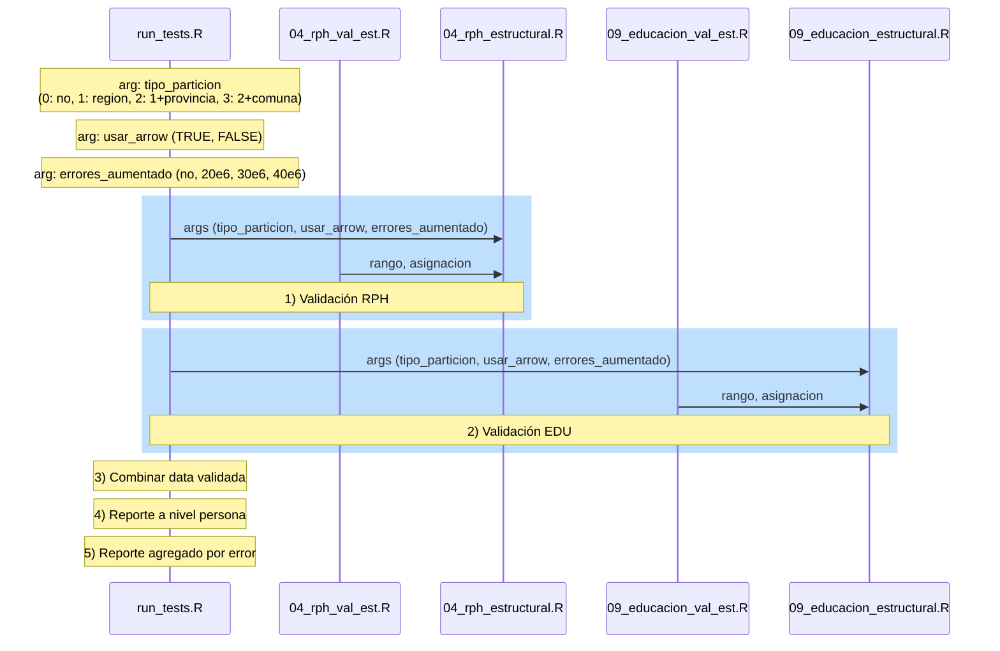

# eficiencia-censo-validacion
Repositorio para almacenar y compartir material relacionado a mejorar la eficiencia en la etapa de validación de datos del Censo 2024

## Etapas de procesamiento

## Resultados de procesamiento

Los resultados de tiempos de procesamiento para las herramientas testeadas se muestran en la figura:

[`03_resultados/01_tiempo_procesamiento/test_all.png`](03_resultados/01_tiempo_procesamiento/test_all.png)

Estos resultados fueron obtenidos en una máquina que cuenta con las siguientes características:

- S.O.: Linux, Ubuntu 22.04.3 LTS (jammy)
- RAM: 16 GB.
- CPU: 32 núcleos.
- Python: v3.11.4
- R: v4.3.1

## Etapas de procesamiento

En la siguiente tabla se muestran las herramientas de procesamiento que han sido testeadas para producir los resultados aquí presentados. 

| Etapa                   | Detalle                                                           |
|-------------------------|-------------------------------------------------------------------|
| Validación RPH          | Aplicación de validadores de la batería del registro de personas  |
| Validación EDU          | Aplicación de validadores de la batería de educación              |
| Combinar data validada  | Se combina data validada de ambas baterías                        |
| Reporte nivel persona   | Creación de reporte de validación a nivel de persona              |
| Reporte agregado        | Creación de reporte de validación agregado por regla de validació |

## Ejecución de tests

Para poder ejecutar los tests, el primer paso es clonar este repositorio en la máquina que será utilizada para el procesamiento.

Luego se deben descargar los datasets que son usados por los diferentes scripts desde el siguiente link: 
[01_base_censo_publicada](https://inechile-my.sharepoint.com/:f:/g/personal/hesotop_ine_gob_cl/ElGhFSiQj6RMhkjWfSXLJEMB7WSehYdJpSNiHI6ENDlqWA?e=LCJjQS)  
Una vez se ha completado la descarga, es necesario copiar el contenido de la carpeta descargada al directorio [`01_base_censo_publicada`](01_base_censo_publicada/) del repositorio clonado, que contiene un archivo `info` de referencia.

Cada script en la tabla anterior puede ser ejecutado ajustando los valores de dos parámetros dentro del script: `arg_data_aumentado`, `arg_variables_aumentadas`.
Los valores de estos parámetros determinan el tipo de **Test** que se ejecuta, según se muestra en la siguiente tabla.  

| Test                                                             | Variables evaluadas             |
|------------------------------------------------------------------|---------------------------------|
| (1) Uso de función de validación implementada en Arrow               | True, False                     |
| (2) Particionamiento de input dataset usando variables geográficas:  | región, provincia, comuna       |
| (3) Aumento de errores en validación:   modificando artificialmente dataset original | ~10e6, ~20e6, ~30e6, ~40e6   errores |

Más detalles sobre ambos ambos parámetros son descritos a continuación.

(1) El parámetro `arg_data_aumentado` controla **volumen de los datos** que se procesarán en el test. Lo que a su vez define el dataset que será leído por cada script (csv o feather, dependiendo de la herramienta usada).  
Este parámetro toma uno de los siguientes valores:

`"data_no_aumentado"`: dataset original. Archivos leídos:
  - Microdato_Censo2017-Personas__data_no_aumentado.csv
  - Microdato_Censo2017-Personas__data_no_aumentado_arrow_withnrow.feather

`"data_aumentado_05M"`: dataset aumentado artificialmente en 5 millones de registros. Archivos leídos:
  - Microdato_Censo2017-Personas__data_aumentado_05M.csv
  - Microdato_Censo2017-Personas__data_aumentado_05M_arrow_withnrow.feather

`"data_aumentado_10M"`: dataset aumentado artificialmente en 10 millones de registros. Archivos leídos:
  - Microdato_Censo2017-Personas__data_aumentado_10M.csv
  - Microdato_Censo2017-Personas__data_aumentado_10M_arrow_withnrow.feather

(2) El parámetro `arg_variables_aumentadas` controla el **número de variables auxiliares** que serán creadas durante el test. Este parámetro toma uno de los siguientes valores:

`"FALSE"`: se mantiene el número de variables auxiliares creadas en el test original (Test "Sin Aumentar")  
`"TRUE"`: se aumenta al doble el número de variables auxiliares creadas, comparado al test original.

## Almacenado de resultados

Al final de cada ejecución del script [`run_test.R`](run_test.R), se imprime un dataframe con los tiempos en que las diferentes etapas del procesamiento fueron completadas.
Estos resultados también son almacenados en un archivo xlsx en el directorio [`resultados/tiempo_censo_validacion`](resultados/tiempo_censo_validacion/). El archivo xlsx se crea si no existe y los resultados se escriben a una nueva hoja.
