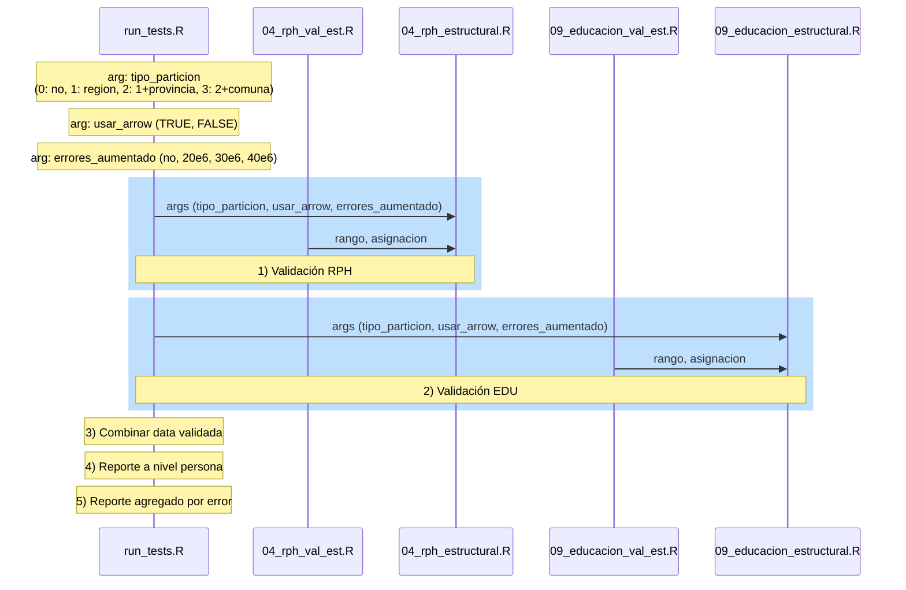

# eficiencia-censo-validacion
Repositorio para almacenar y compartir material relacionado a mejorar la eficiencia en la etapa de validación de datos del Censo 2024

## Etapas de procesamiento

```mermaid
sequenceDiagram
  participant run as run_tests.R
  participant rph_val as 04_rph_val_est.R  
  participant rph as 04_rph_estructural.R
  participant edu_val as 09_educacion_val_est.R  
  participant edu as 09_educacion_estructural.R
  Note over run: arg: tipo_particion <br> (0: no, 1: region, 2: 1+provincia, 3: 2+comuna) 
  Note over run: arg: usar_arrow (TRUE, FALSE)
  Note over run: arg: errores_aumentado (no, 20e6, 30e6, 40e6)
  rect rgb(191, 223, 255)
  run ->> rph: args (tipo_particion, usar_arrow, errores_aumentado)
  rph_val ->> rph: rango, asignacion
  Note over run,rph: 1) Validación RPH
  end
  rect rgb(191, 223, 255)  
  run ->> edu: args (tipo_particion, usar_arrow, errores_aumentado)
  edu_val ->> edu: rango, asignacion
  Note over run,edu: 2) Validación EDU  
  end
  Note over run: 3) Combinar data validada
  Note over run: 4) Reporte a nivel persona
  Note over run: 5) Reporte agregado por error      
```
