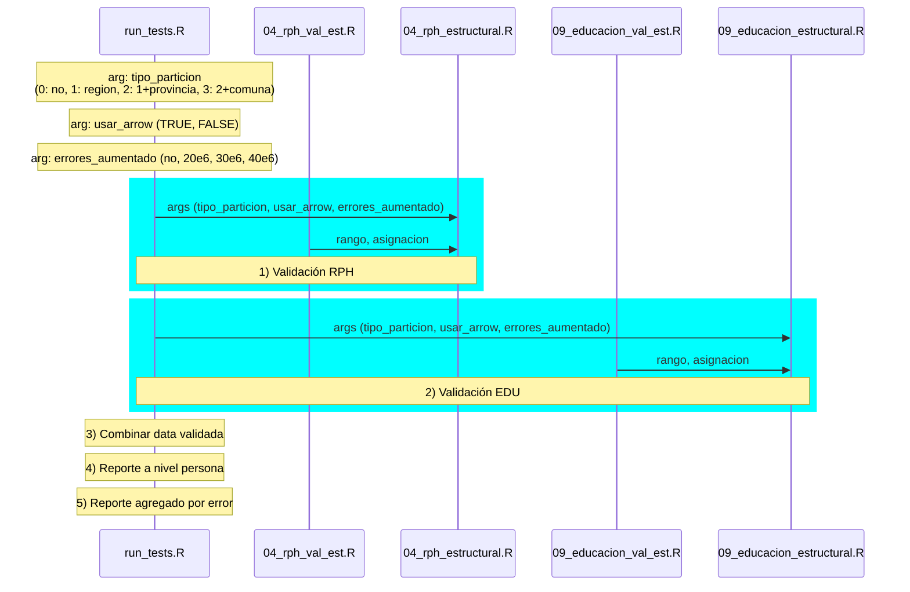

# eficiencia-censo-validacion
Repositorio para almacenar y compartir material relacionado a mejorar la eficiencia en la etapa de validación de datos del Censo 2024

Para clonar este repositorio, ejecutar localmente el comando:

```
git clone https://github.com/mentoria-censo/eficiencia-censo-validacion.git
```


## Etapas de procesamiento



El flujo de procesamiento se resume en el diagrama anterior y sus etapas se indican en la siguiente tabla.
El procesamiento se ejecuta corriendo el script [`run_tests.R`](run_tests.R) con ciertos parámetros definidos por el usuario.
Este script internamente ejecuta la validación de las baterías del registro de personas (RPH, script [`04_rph_estructural.R`](04_rph_estructural.R)) y de educación (EDU, script [`09_educacion_estructural.R`](09_educacion_estructural.R)).
Los resultados de cada validación se combinan a continuación para generar reportes en dos formatos: a nivel de persona y agregado por regla de validación (tipo de error).

| Etapa                   | Detalle                                                           |
|-------------------------|-------------------------------------------------------------------|
| Validación RPH          | Aplicación de validadores de la batería del registro de personas  |
| Validación EDU          | Aplicación de validadores de la batería de educación              |
| Combinar data validada  | Se combina data validada de ambas baterías                        |
| Reporte nivel persona   | Creación de reporte de validación a nivel de persona              |
| Reporte agregado        | Creación de reporte de validación agregado por regla de validació |


## Ejecución de tests

**NOTA:** Para poder reproducir los resultados de los tests, es necesario contar con el dataset original pero además con los datasets que fueron creados artificialmente para los diferentes tests implementados: datasets particionados y con errores aumentados.
Estos datasets pueden ser compartidos a pedido y deben ser copiados al directorio [`data`](data/) del repositorio clonado. El archivo [`info`](data/info) contiene los nombres esperados de estos datasets.

El script [`run_tests.R`](run_tests.R) puede ser ejecutado ajustando los valores de ciertos parámetros dentro del script, cuyos valores se definen como strings y se indican en la siguiente tabla de acuerdo al tipo de **Test** ejecutado. <br>

| Test                                                             | Parámetro | Valores evaluadas             |
|-|-|-|
| (1) Uso de función de validación implementada en Arrow               | usar_arrow_para_validacion | TRUE, FALSE                     |
| (2) Particionamiento de input dataset usando variables geográficas:  | tipo_particion | 0: sin particionar <br> 1: region <br> 2: region, provincia <br> 3: region, provincia, comuna |
| (3) Aumento de errores en validación: <br> modificando artificialmente dataset original | errores_aumentado | no, 10e6, 20e6, 30e6, 40e6 |

En el caso del parámetro `tipo_particion`, los valores indicados corresponden a las columnas usadas para crear los datasets particionados. 
Para el parámetro `errores_aumentado`, los valores evaluados indican la cantidad de errores que fueron introducidos aleatoriamente en el dataset original y se definen usando el prefijo "err_aum_" seguido por el valor indicado en la tabla.

## Resultados de procesamiento

Al final de cada ejecución del script [`run_tests.R`](run_tests.R), se imprime un dataframe con los tiempos en que las diferentes etapas del procesamiento fueron completadas.
Estos resultados también son almacenados en un archivo xlsx en el directorio [`resultados/tiempo_censo_validacion`](resultados/tiempo_censo_validacion/). El archivo xlsx se crea si no existe y los resultados se escriben a una nueva hoja.

Los resultados de tiempos de procesamiento para los tests implementados se resumen en los plots en el directorio [`resultados/*.png`](resultados). Estos plots también están incluidos en la presentación compartida y son creados por el script [`plot_execution_times.R`](scripts_extra/plot_execution_times.R), que usa como input el archivo xlsx antes mencionado.

Estos resultados fueron obtenidos en una máquina que cuenta con las siguientes características:

- S.O.: Linux, Ubuntu 22.04.3 LTS (jammy)
- RAM: 16 GB.
- CPU: 32 núcleos.
- Python: v3.11.4
- R: v4.3.1
